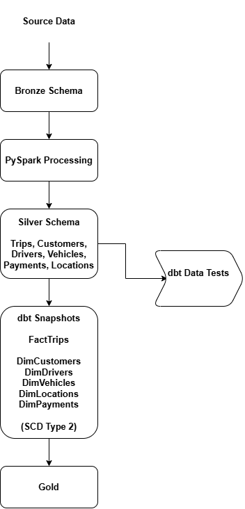

# PySpark + dbt Analytics Engineering Project

## Overview

An end-to-end Analytics Engineering project built using **Databricks**, **PySpark Structured Streaming**, and **dbt Cloud** following the **Medallion Architecture (Bronze → Silver → Gold)**.

This project demonstrates incremental data processing, dbt transformations, SCD Type 2 snapshots, and data quality testing.

---

## Project Architecture

---

## Tech Stack

- Databricks
- PySpark
- Delta Lake
- dbt Cloud
- SQL
- Git
- GitHub

---

## Key Features

- Medallion Architecture (Bronze → Silver → Gold)
- Incremental data ingestion using PySpark Structured Streaming
- Incremental transformations using dbt Models
- Slowly Changing Dimensions (SCD Type 2) using dbt Snapshots
- Data quality validation using dbt Tests

---

## Author

**Abdul Wahab**

GitHub: https://github.com/AbdulWahab-DS
